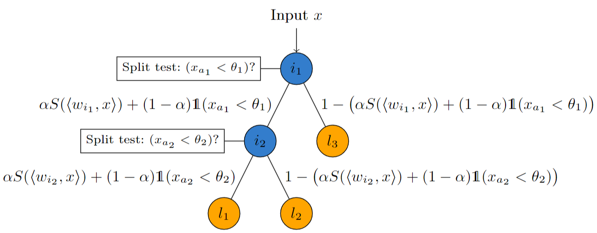

# Soft Hoeffding Tree
<p align="center">
  
</p>

This repository contains a new predictive base learner Soft Hoeffding Tree (SoHoT) for large data streams.
A new gating function is used to regulate the balance between transparent and soft routing in a SoHoT, 
which is essentially a trade-off between transparency and performance. 
SoHoT can be used in an ensemble layer due to its differentiability.


## Example Code
```python
from benchmark.load_data import get_data_loader
from sohot.sohot_ensemble_layer import SoftHoeffdingTreeLayer
import torch

lr = 1e-3
batch_size = 32
data_stream = 'sea50'
# Load data
data, input_dim, output_dim, _ = get_data_loader(data_stream, batch_size=batch_size, nrows=10000)
sohotel = SoftHoeffdingTreeLayer(input_dim, output_dim)

# Initialize an Optimizer
optim = torch.optim.Adam(sohotel.parameters(), lr=lr)
optim.zero_grad()
old_params = sum(1 for _ in sohotel.parameters())
criterion = torch.nn.CrossEntropyLoss()
softmax = torch.nn.Softmax(dim=-1)

num_correct = 0
num_samples = 0

for i, (x, y) in enumerate(data):
    output = sohotel(x, y)

    output_softmax = [softmax(out) for out in output.detach()]
    for b in range(batch_size):
        num_samples += 1
        if torch.argmax(output_softmax[b]) == y[b]:
            num_correct += 1

    # If the number of parameters has changed, update the optimizer such that the new weight parameter
    # are registered and also updated in the backward pass
    if old_params != sum(1 for _ in sohotel.parameters()):
        optim = torch.optim.Adam(sohotel.parameters(), lr=lr)
        old_params = sum(1 for _ in sohotel.parameters())

    loss = criterion(output, y)
    loss.backward()
    optim.step()
    optim.zero_grad()

print("Accuracy: {:.4f}".format(num_correct / num_samples))
```